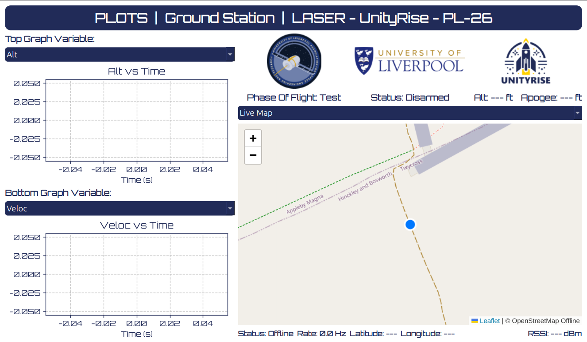

# PLOTS - Ground Station Software


A desktop GUI application for Live Flight Telemetry Analysis intended for the **PL-26** Launch Vehicle Rocket, developed for the **Unity Rise University of Liverpool Rocket Team** (2025-26 launch).

## Project Context
* **Project Title:** LASER - PLOTS (Live Telemetry Ground Station)
* **Launch Vehicle Rocket:** PL-26 (Unity Rise, 2025-26)

## What This Software Does

The PLOTS Ground Station is an interactive, real-time dashboard designed to receive, log and visualise live flight data transmitted via RF from the PL-26 LIFTS onboard avionics system. It provides:

* **Real-Time 2D Plotting:** Interactive live graphs for altitude, velocity and RSSI telemetry data over time.
* **Dynamic 3D Spatial Visualisation:** * Live 3D trajectory plot tracking INS relative position (X, Y, Z).
  * Real-time 3D rocket attitude rendering using a loaded `.stl` launch vehicle model driven by live flight quaternion data.
* **Geospatial Tracking:** An offline-capable Leaflet map that tracks the rocket's GPS path, supported by an internal local tile directory for remote launch sites.
* **Automated Data Logging:** Instantaneous background writing of the live incoming telemetry stream to dynamically sequenced CSV backup files (`Ground_Station_Flight_Data_X.csv`).
* **Mission Status:** Live flight phase logic evaluation, max apogee tracking, stream rate monitoring (Hz), hardware arming status, VEGA Rideshare experiement status...

## Runtime Architecture

The software is built in Python using a synchronous UI architecture designed for rapid, low-latency telemetry updates (30ms intervals):

* **GUI Framework:** `PySide6` (Qt) for the main application layout, stacked 3D visualisers and UI elements.
* **2D Graphics:** `matplotlib` integrated via `FigureCanvasQTAgg`, globally styled with the custom Orbitron font for high-performance telemetry plotting.
* **3D Graphics:** `pyqtgraph.opengl` and `numpy-stl` for rendering and transforming the 3D launch vehicle orientation matrix.
* **Mapping Subsystem Interface:** `QWebEngineView` injects HTML/JS for Leaflet.js, utilising absolute local file paths to render map tiles without an active internet connection.
* **Hardware Interface:** `pyserial` handles the direct UART serial communication buffering and decoding from the RF ground receiver.

## Data Inputs

### Live Serial Stream (UART)
The software expects a live serial connection (e.g., `/dev/ttyACM0` or `COM3`) operating at a **115200 Baud Rate**. It parses a 13-value comma-separated string transmitted by the LIFTS avionics system. 

Expected indexed values per packet:
1. `Timestamp`
2. `Alt` (Meters - converted internally to Feet for UI)
3. `Veloc` (m/s)
4. `Lat` (Decimal Degrees)
5. `Lon` (Decimal Degrees)
6. `qR`, `qI`, `qJ`, `qK` (Orientation Quaternions)
7. `insX`, `insY`, `insZ` (Inertial Navigation Relative Position in Meters)
8. `RSSI` (Signal Strength in dBm)

## Repository Structure

```text
pl26-groundstation/
|- Assets/
|  |- rocket.stl
|  |- LASER_Logo.png
|  |- unityrise_logo.png
|  |- uol_logo.png
|  |- Orbitron-VariableFont_wght.ttf
|  |- PLOTS_Sample_IMG.png
|- Data/                   #Dynamically generated CSV flight logs
|- tiles/                  #Offline OpenStreetMap tiles (auto-generated)
|- venv/
|- leaflet.css             #Local map dependency
|- leaflet.js              #Local map dependency
|- PLOTS.py                #Main application source code      
|- README.md